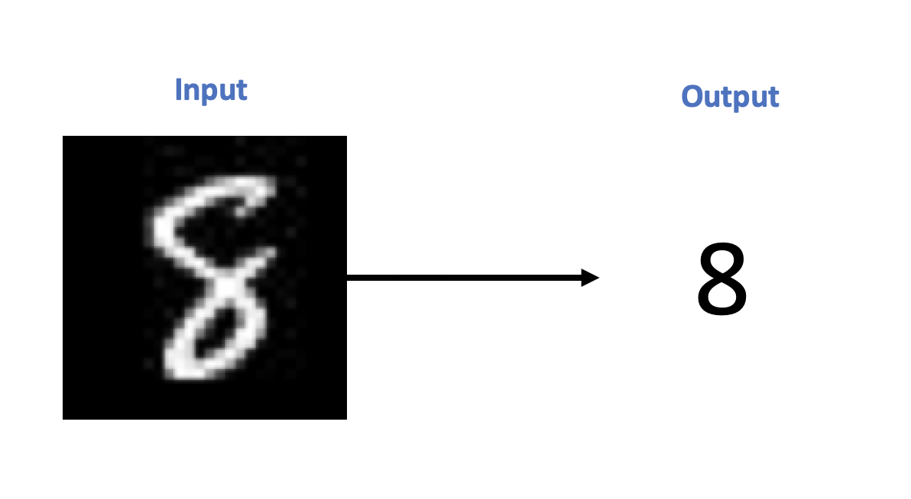

# MAX-PyTorch-MNIST

Classify the handwritten digits.



Data Source: http://yann.lecun.com/exdb/mnist/

Framework: PyTorch

# Requirements

1. Docker
2. Python code editors
3. Pre-trained model weights stored in a downloadable location
4. List of required python packages
5. Input pre-processing code
6. Prediction/Inference code
7. Output variables
8. Output post-processing code

# Steps

1. [Fork the Template and Clone the Repository](#fork-the-template-and-clone-the-repository)
2. [Update Dockerfile](#Update-dockerfile)
3. [Update Package Requirements](#update-package-requirements)
4. [Update API and Model Metadata](#update-api-and-model-metadata)
5. [Update Scripts](#update-scripts)
6. [Build the model Docker image](#build-the-model-docker-image)
7. [Run the model server](#run-the-model-server)

## Fork the Template and Clone the Repository

1. Login to GitHub and go to [MAX Skeleton](https://github.com/IBM/MAX-Skeleton)

2. Click on `Use this template` and provide a name for the repo.

3. Clone the newly created repository using the below command:

```bash
$ git clone https://github.com/......
```

## Update Dockerfile

Update,

- `ARG model_bucket=` with the link to the model file you've created to public storage that can be downloaded

- `ARG model_file=` with the model file name.

Alternatively, you can use our pre-trained model:

```
model_bucket = https://github.com/xuhdev/max-pytorch-mnist/raw/master/pretrained-model
model_file = mnist-classifier.tar.gz
```

Calculate and add the SHA512 hashes of the files that will be downloaded to sha512sums.txt.

Here, hash will be calculated for `mnist-classifier.pt` using the command:

```
sha512sum mnist-classifier.pt
```

## Update Package Requirements

Add required python packages for running the model prediction to requirements.txt.

Following packages are required for this model:

   - Pillow==7.1.2
   - torch==1.5.0
   - torchvision==0.6.0

Therefore, you should add the following to `requirements.txt`:

```
--find-links https://download.pytorch.org/whl/torch_stable.html
torch==1.5.0+cpu
torchvision==0.6.0+cpu
Pillow==7.1.2
```

## Update API and Model Metadata

1. In `config.py`, update the API metadata.

  - API_TITLE
  - API_DESC
  - API_VERSION

2. Set `MODEL_NAME = 'mnist-classifier.pt'`

   _NOTE_: Model files are always downloaded to `assets` folder inside docker.

3. In `core/model.py`, fill in the `MODEL_META_DATA`

     - Model id
     - Model name
     - Description of the model
     - Model type based on what the model does (e.g. Digit recognition)
     - Source to the model belongs
     - Model license

## Update Scripts

All you need to start wrapping your model is pre-processing, prediction and post-processing code.

1. Create file `model/__init__.py`. Create the CNN that you used during training.

   ```python
   from torch import nn
   import torch.nn.functional as F


   class MyConvNet(nn.Module):
       def __init__(self):
           super().__init__()
           self.conv1 = nn.Conv2d(1, 2, 5)
           self.pool = nn.MaxPool2d(2, 2)
           self.conv2 = nn.Conv2d(2, 6, 5)
           self.fc1 = nn.Linear(96, 32)
           self.fc2 = nn.Linear(32, 10)

       def forward(self, x):
           x = self.pool(F.relu(self.conv1(x)))
           x = self.pool(F.relu(self.conv2(x)))
           x = x.view(-1, 96)
           x = F.relu(self.fc1(x))
           x = self.fc2(x)
           return x
   ```

2. In `core/model.py`, import required modules at the beginning after the comments.

   ```python
   import io
   import logging
   from PIL import Image
   import torch
   from torchvision import transforms
   from config import DEFAULT_MODEL_PATH
   from model import MyConvNet
   ```

3. In `core/model.py`, load the model under `__init__()` method.
   Here, saved model `.pt` can be loaded using the below command:

   ```python
   logger.info('Loading model from: {}...'.format(path))
   self.net = MyConvNet()
   self.net.load_state_dict(torch.load(path))  # load model
   logger.info('Loaded model')

   # Transform like what the training has done
   self.transform = transforms.Compose(
       [transforms.ToTensor(),
         transforms.Normalize((0.5,), (0.5,))])
   ```

4. In `core/model.py`, pre-processing functions required for the input should get into the `_pre_process` function.
   Here, the input image needs to be read and converted into an array of acceptable shape.

   ```python
   with Image.open(io.BytesIO(inp)) as img:
     img = self.transform(img)
     img = img[None, :, :]  # Create a batch size of 1
     logger.info('Loaded image... %d', img.size)
     return img

   return None
   ```

  _NOTE_: Pre-processing is followed by prediction function which accepts only one input,
          so create a dictionary to hold the return results if needed. In this case, we only have one input so we
          are good to go.

5. Predicted digit and its probability are the expected output. Add these two fields to `label_prediction` in `api/predict.py`

   ```python
   label_prediction = MAX_API.model('LabelPrediction', {
   'prediction': fields.Integer(required=True),
   'probability': fields.Float(required=True)
   })
   ```

 _NOTE_: These fields can very depending on the model.

6. Place the prediction code under `_predict` method in `core/model.py`.
   In the above step, we have defined two outputs. Now we need to extract these two results
   from the model.

   _NOTE_: Prediction is followed by post-processing function which accepts only one input,
           so create a dictionary to hold the results in case of multiple outputs returned from the function.

   ```python
   return self.net(x)
   ```

7. Post-processing function will go under `_post_process` method in `core/model.py`.
   Result from the above step will be the input to this step.

   Here, result from the above step will contain prediction probability for all 10 classes (digit 0 to 9).

   Output response has two fields `status` and `predictions` as defined in the `api/predict.py`.

   ```python
   predict_response = MAX_API.model('ModelPredictResponse', {
     'status': fields.String(required=True, description='Response status message'),
     'predictions': fields.List(fields.Nested(label_prediction), description='Predicted labels and probabilities')
   })
   ```

   Predictions is of type list and holds the model results. Create a dictionary inside a list with key names used in `_predict` (step 4) and update the
   model results accordingly.

   ```python
   probability, prediction = torch.max(result, dim=1)
   return [{'probability': probability,
            'prediction': prediction}]

   ```

8. Assign the result from post-processing to the appropriate response field in `api/predict.py`.

   ```python
   # Assign result
   preds = self.model_wrapper.predict(input_data)
   result['predictions'] = preds
   ```

9. Add test images to `samples/`. You can find MNIST test images in png format from https://github.com/myleott/mnist_png .

## Build the model Docker image

To build the docker image locally, run:

```
$ docker build -t max-pytorch-mnist .
```

If you want to print debugging messages make sure to set `DEBUG=True` in `config.py`.

## Run the model server

To run the docker image, which automatically starts the model serving API, run:

```
$ docker run -it -p 5000:5000 max-pytorch-mnist
```
